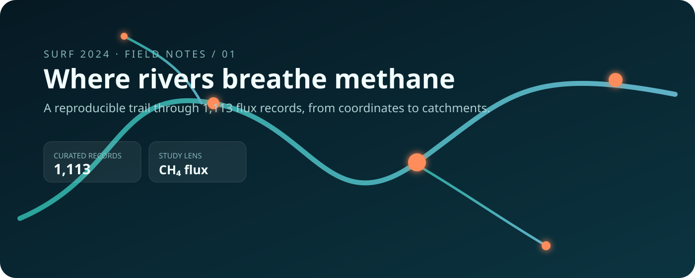
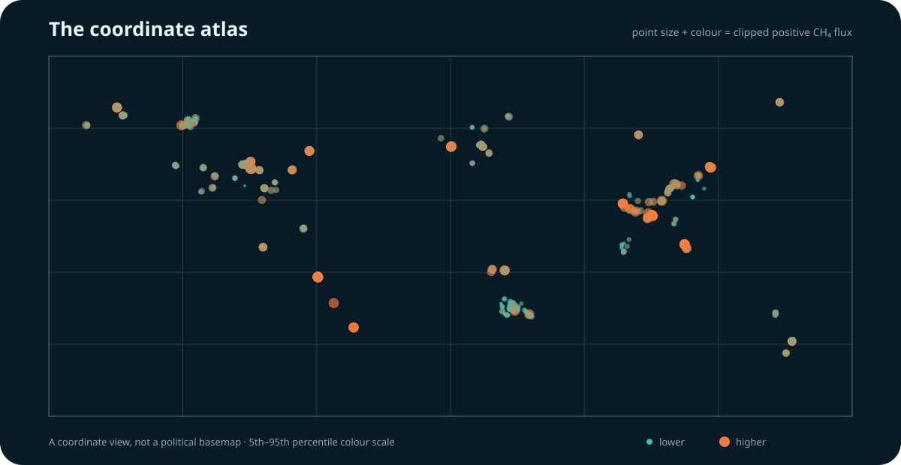

<p align="center"></p>

# SURF 2024 · River methane drivers

This repository turns a summer research project into a compact **river-methane field atlas**. The question is simple to ask and difficult to answer: when a river releases more methane, which parts of its setting travel with that change?

The project follows a transparent trail from a public GRiMeDB-derived table to coordinate-level exploration and two interpretable regression families. It is a project story—not a dump of every draft, package cache, or intermediate workbook.

## The trail

`measurements → quality screen → coordinate atlas → driver models → cautious interpretation`

| Stop | What is here |
|---|---|
| **Observe** | 1,113 matched records with gas fluxes, coordinates and river descriptors |
| **Screen** | Positive CH₄ fluxes; 5th–95th percentile sensitivity window |
| **Locate** | A dependency-free SVG coordinate atlas generated from the checked-in CSV |
| **Model** | Base-R geography and river-network models with coefficients and diagnostics |
| **Audit** | A small Python validator checks row counts, schema and generated artefacts |

<p align="center"></p>

## What this project found

The original SURF analysis pointed to geography, elevation and catchment structure as useful companions of methane-flux variation. The public repository deliberately separates that project interpretation from the reproducible descriptive layer: the pairwise correlations and linear models here are **associations, not causal effects**.

## Reproduce the public layer

```bash
python scripts/build_atlas.py
python scripts/validate_repo.py
Rscript analysis/01_river_methane_models.R
```

The first two commands use only Python's standard library. The R analysis uses base R and writes model tables into `results/`.

## Repository map

```text
analysis/   interpretable base-R models
assets/     custom hero and generated coordinate atlas
data/       curated public analysis table
results/    machine-readable audit and descriptive summaries
scripts/    atlas builder and repository validator
```

Read [METHODOLOGY.md](METHODOLOGY.md) for analytical decisions and [DATA.md](DATA.md) for provenance, fields and limitations.

## Scientific context

This project builds on GRiMeDB and the global river-methane literature. The full database contains 24,024 CH₄ concentration records and 8,205 flux measurements from 5,029 sites; this repository carries only the 1,113-row merged subset used by its public analysis layer.

> **Scope note:** negative measured fluxes can be scientifically meaningful, but a logarithmic positive-flux analysis cannot represent them. They remain in the source CSV and are excluded only from that modelling view.

## Credits

SURF 2024 project by Xiyao Chen. Data provenance and recommended citations are in [DATA.md](DATA.md). Code is available under the MIT license; upstream data retain their original terms.
